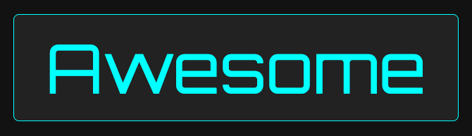

	

		
	

	

# Node.js
- [awesome-nodejs](https://github.com/sindresorhus/awesome-nodejs) - Curating the best Node.js modules and resources

# JavaScript
- [JSDoc typings](https://gils-blog.tayar.org/posts/jsdoc-typings-all-the-benefits-none-of-the-drawbacks) - JSDoc typings: all the benefits of TypeScript, with none of the drawbacks
- [mdn](https://reactjs.org) - Mozilla Developer Network
- [react-typescript-cheatsheet](https://react-typescript-cheatsheet.netlify.app/docs/basic/setup) - React Cheatsheet
- [eslint](https://eslint.org) - ESlint
- [eslint-rules](https://eslint.org/docs/latest/rules) - ESlint rules
- [typescript-eslint](https://typescript-eslint.io) - TypeScript ESLint
- [typescript-eslint-rules](https://typescript-eslint.io/rules) - TypeScript ESLint rules

# JavaScript Testing
- [playwright](https://playwright.dev/docs/intro) - Playwright

# Online code editor
- [codesandbox](https://codesandbox.io) - CodeSandbox
- [codesandbox-mui](https://codesandbox.io/s/material-ui-issue-latest-s2dsx) - MUI Codesandbox
- [codepen](https://codepen.io) - CodePen
- [jsonparser](https://jsonparser.org) - JsonParser
- [python](https://www.online-python.com) - Online Python
- [regex101](http://www.regex101.com) - regular expressions

# React
- [react](https://reactjs.org) - React
- [mui](https://mui.com/core) - MUI
- [reactjsexample](https://reactjsexample.com) - ReactJS examples

# AI
- [chatgpt](https://chatgpt.com) - ChatGPT
- [claude](https://claude.ai) - Claude
- [gemini](https://gemini.google.com) - Gemini
- [deepseek](https://chat.deepseek.com) - DeepSeek
